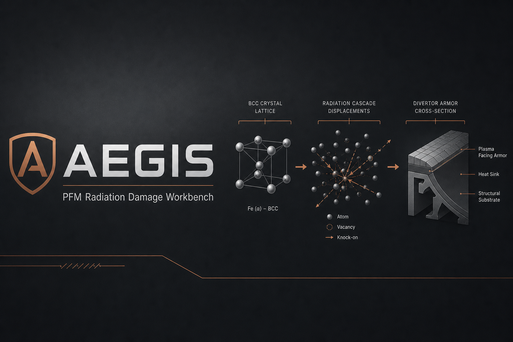
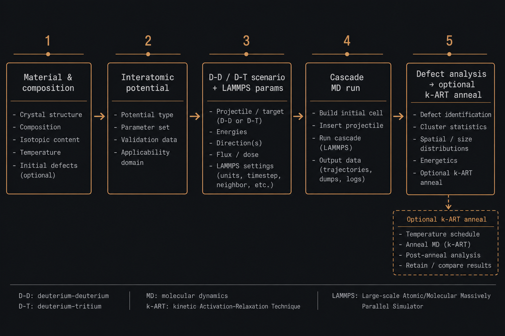

# Aegis

**Local workbench for microscopic radiation damage in tokamak plasma-facing materials (PFMs).**

Select material and composition → attach a published interatomic potential → apply D–D / D–T irradiation presets → run LAMMPS cascade or He implantation → inspect defects → optionally anneal with k-ART.



> **Scale honesty:** Aegis runs **cascade / implant MD** and optional **KMC annealing**. Fuel choices (D–D / D–T) are **irradiation scenario presets** (energies, temperature, labels)—not plasma transport or neutronics.

---

## Workflow



| Step | What you do | What Aegis produces |
|------|-------------|---------------------|
| 1 | Name a project; browse prior jobs | Job history under `runs/` |
| 2 | Choose PFM preset; edit composition (at%/wt%) | `material.json` |
| 3 | Pick curated or uploaded potential | Validated `pair_style` / file path |
| 4 | Select D–D / D–T / He / surface scenario | Scenario overrides |
| 5 | **Simulate**: Compute (MPI / KMC threads) → cell → cascade → optional kMC | `run_params.json` |
| 6 | **Run** (or export Slurm/PBS pack) | Live log, dumps, or remote `submit.slurm` |
| 7 | **Results**; then **Campaigns** for sweeps | Defects, anneals, DOE tables |

---

## Quick start (Windows)

```bat
setup_and_run.cmd
```

Installs only what is missing (Python, Node, Git, API/UI deps, **MS-MPI**, **MPI-capable LAMMPS** (`*-MSMPI.exe`, not the GUI serial build), KART **clone**), then opens the UI at [http://127.0.0.1:5173](http://127.0.0.1:5173).

If Engines shows `lmp MPI = serial?`, use **Install parallel LAMMPS (MS-MPI)** on Simulate / Engines (or re-run setup). Then set **LAMMPS MPI ranks** &gt; 1 — Aegis launches `mpiexec -localonly N lmp -in …`.

## Quick start (Linux / macOS)

```bash
bash setup_and_run.sh
```

Best-effort OpenMPI install (`apt` / `dnf` / `yum` / `brew`), Python venv + npm deps, then API + UI.

| Already installed? | Behavior |
|--------------------|----------|
| `python` / `node` / `git` on PATH | Skipped |
| `lmp.exe` / `lmp` found | Skipped (no reinstall; set `AEGIS_FORCE_LAMMPS_INSTALL=1` to force) |
| `mpiexec` / MS-MPI present | Skipped (`AEGIS_INSTALL_MPI=0` also skips) |
| `third_party/kart` + binary | Skipped |

**KART:** private GitLab project. Put `GITLAB_TOKEN` in a gitignored `.env` (or use SSH). Full obtain/build guide: [`engines/kart/SETUP.md`](engines/kart/SETUP.md). On Windows, build in **WSL** or **Docker**—native MSVC is unsupported.

---

## Manual start

```bash
# API
cd apps/api
python -m venv ../../.venv
../../.venv/Scripts/activate   # Windows
pip install -r requirements.txt -e ../../packages/schema
uvicorn aegis_api.main:app --reload --port 8000

# UI (second terminal)
cd apps/web
npm install
npm run dev
```

---

## Stack

| Layer | Technology |
|-------|------------|
| UI | React + Vite — expert console for nuclear materials workflows |
| API | FastAPI job orchestrator + WebSocket logs |
| MD | LAMMPS (out-of-process) |
| Potentials | Local catalog + NIST IPR download (allowlisted) / manual upload |
| KMC | KART / k-ART (optional; stubs if binary missing) |
| Data | JSON materials, scenarios, potential catalog |

---

## Environment

Copy `.env.example` → `.env` (never commit secrets).

| Variable | Purpose |
|----------|---------|
| `AEGIS_LAMMPS_BIN` | Path to `lmp` / `lmp.exe` |
| `AEGIS_MPIEXEC` | Optional path to `mpiexec` / `mpirun` (MS-MPI, OpenMPI, …) |
| `AEGIS_MPI_PROCS` | Default MPI ranks when job `mpi_procs` is unset (default `1`) |
| `AEGIS_INSTALL_MPI` | Set `0` to skip MS-MPI (Windows) / OpenMPI (Linux) bootstrap |
| `AEGIS_LAMMPS_MPI_URL` | Override Windows `*-MSMPI.exe` installer URL |
| `AEGIS_LAMMPS_SERIAL_OK` | Set `1` to keep a serial/GUI `lmp` and skip MSMPI upgrade |
| `AEGIS_OVITO_BIN` | Optional path to OVITO Pro `ovitos` (not GUI `ovito.exe`); bootstrap also tries `pip install -U ovito==3.15.5` |
| `AEGIS_OVITO_PIP_SPEC` | Override OVITO pip pin (default `ovito==3.15.5`) |
| `AEGIS_INSTALL_OVITO` | Set `0` to skip first-run OVITO pip (default: attempt; soft-fail) |
| `AEGIS_ATOMSK_BIN` | Optional Atomsk binary for polycrystal / GB builds (ASE Voronoi fallback) |
| `AEGIS_ATOMSK_URL` | Override Atomsk Windows zip URL (default univ-lille `atomsk_b0.13.1_Windows.zip`) |
| `AEGIS_INSTALL_ASE` / `AEGIS_INSTALL_ATOMSK` | Set `0` to skip ASE / Atomsk bootstrap steps |
| `AEGIS_KART_ROOT` / `AEGIS_KART_BIN` | KART clone / binary |
| `AEGIS_KART_COMMIT` | Pin (default `62d66adf`) |
| `GITLAB_TOKEN` | Clone KART only (local `.env`) |

---

## Repository layout

```
setup_and_run.cmd     Windows bootstrap + UI (incl. MS-MPI)
setup_and_run.sh      Linux/macOS bootstrap + UI (incl. OpenMPI)
scripts/bootstrap.ps1
apps/web/             React workbench
apps/api/             FastAPI
packages/schema/      Shared schemas
engines/lammps/mpi.py MPI launch helpers
engines/lammps/       Input templates
engines/kart/         Adapter + SETUP.md
data/                 Materials, scenarios, potentials
docs/assets/          README figures
third_party/kart/     Local KART clone (gitignored)
runs/                 Job artifacts (gitignored)
```

---

## Engineering notes

- **Potentials:** Aegis never invents coefficients. Use **Potential → Acquire** for ranked NIST/OpenKIM downloads and browse links, or upload a published file. See [docs/potentials.md](docs/potentials.md). Placeholders are dry-run only.
- **Defect analysis:** Phase-1 Wigner–Seitz-style proxy for engineering inspection—not a replacement for OVITO production analysis. Enable DXA from the LAMMPS tab or Results. `setup_and_run` tries `pip install -U ovito==3.15.5` on first run (soft-fail); see [docs/ovito.md](docs/ovito.md).
- **Nanostructures:** LAMMPS tab → Structure (`polycrystal`, `bicrystal`, `void`, `void_lattice`, `nanowire`, `precipitate`, `polycrystal_void`, `import`) builds `structure.data` via ASE (Atomsk optional) and loads it with `read_data` — see [docs/structures.md](docs/structures.md).
- **Large cells:** runs with &gt;20³ unit cells require explicit confirmation.

---

## First tutorial: W cascade (then He)

1. Run `setup_and_run.cmd` and open the UI.
2. **Projects** — name the study (e.g. `W-cascade-demo`).
3. **Material** — preset *Tungsten (pure)*; optionally toggle wt%/at%.
4. **Potential** — for a real run, upload a published W EAM/FS file (NIST potentials). The demo placeholder only exercises dry-run dumps.
5. **Scenario** — start with *D–T divertor-like defaults*, or switch to *D–D* / *He implantation* / *Low-E He|D surface*.
6. **LAMMPS** — keep a small cell (≤10³) for the first job; confirm if you go larger. Surface mode uses vacuum + free `z` boundary.
7. **Run** — start the job; watch the live log. Without LAMMPS or with the placeholder, Aegis writes demo dumps so Results still work.
8. **Results** — scrub before/after structure frames; inspect vacancy/SIA proxy, surface/fuzz chips (surface mode), and clusters.
9. Optional: enable **Queue KART anneal** and/or **MMonCa OKMC**. Engines explains missing binaries; anneals stub honestly.

For **W–He**, upload a W–He potential, pick the *He implantation* or *Low-E He surface* scenario, and ensure the potential’s element list includes `W` and `He`.

---

## License & citation

MIT for Aegis application code. LAMMPS is GPL; KART has upstream terms. Cite the interatomic potential and engine versions in publications.
